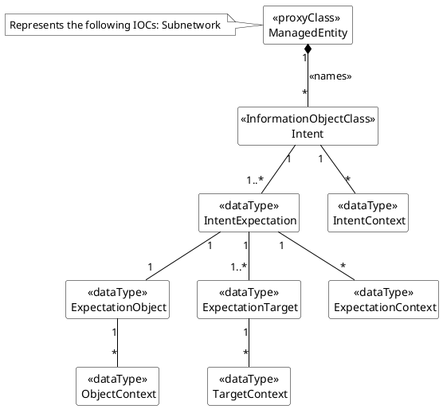
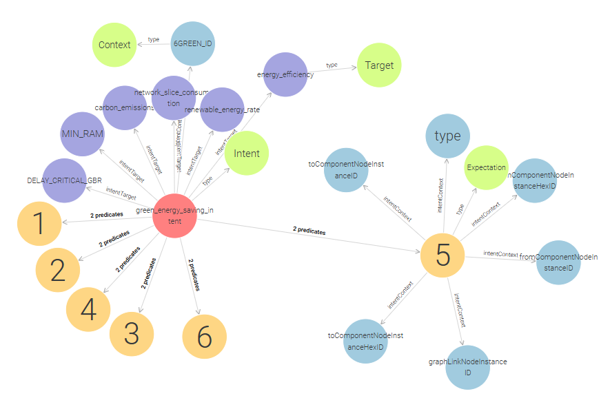

<!-- # © 2024 Telefónica Innovación Digital

# Licensed under the Apache License, Version 2.0 (the "License");
# you may not use this file except in compliance with the License.
# You may obtain a copy of the License at

#     http://www.apache.org/licenses/LICENSE-2.0

# Unless required by applicable law or agreed to in writing, software
# distributed under the License is distributed on an "AS IS" BASIS,
# WITHOUT WARRANTIES OR CONDITIONS OF ANY KIND, either express or implied.
# See the License for the specific language governing permissions and
# limitations under the License. -->
# RDF database integration

The initial information model is the following one defined by 3GPP [Specification # 28.312 (3gpp.org)](https://portal.3gpp.org/desktopmodules/Specifications/SpecificationDetails.aspx?specificationId=3554). 

The Intent information model has been integrated with the intent-engine using OpenAPI schemas and the "datamodel-codegen" tool to autogenerate the Python objects that the engine uses.

In the latest update, an RDF database (GraphDB) has been included to store intents. Also, it's possible to query intents using some defined functions in [core/database_utils.py] such as get_intent_from_userLabel() or get_intent_from_uri().

If an Intent is stored in the GraphDB database, it can be viewed as a node graph. The following image shows a preview of this functionality.

## Other information models

