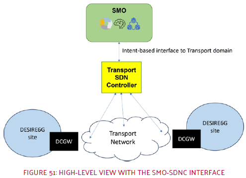

# The Intent Engine
*An Intent Based Network Translator in a Micro-Kernel Architecture*


Original repository: https://github.com/Telefonica/intent_engine/tree/desire6g
# Introduction

The **Intent Engine** is a translator between different technologies, abstracting the specific details of network components from the general directives of higher-level components. This abstract order is known as Intent (*an intention*). It express an expectation of *what* the underlying technologies should do without knowing the *how*. 

Following the structure in [Specification # 28.312 (3gpp.org)](https://portal.3gpp.org/desktopmodules/Specifications/SpecificationDetails.aspx?specificationId=3554) an Intent is divided in :
- Intent:
  - intentContext: Is the scope of the intent itself. It could be used to define administrative task as priority of the intent, times of applicability or identification. This is jet to be define before the final version.
  - intentExpectations: is the request that the user makes to the network
    - expectationVerb: is the main action of the intention. This is usually a verb like create, request, modify, delete, deliver…
    - expectationObject: is the direct complement of the action. The object has a type and an instance, conceptually very similar to a programming language class and its instantiation. Also, the object contains its own objectContext list to provide the required information of itself.
    - expectationContexts: are the scopes in which the expectation is applied. Here are defined where (or when) the action must be performed. For example, a certain RAN area or a specific active cluster.
    - expectationTargets: are the goals or objectives to be reached with the expectation. Translated to a transport network this could be restrictions in bandwidths, latencies, jitter… Every target can also have a more specific context in which is applied.

This definition is broad, and is each library in the intent catalog is the one responsible for translating the intent into a network configuration. 

### A Micro-Kernel Architecture

As the networks are evolving continuously, the technologies should follow along. **The Intent Engine** is build as a central core that processes the Intent and then, tries to translate it to network configurations using the intent catalogue. The intent catalogue is a set of python libraries, each one containing a set of Intent Logic Units (ILUs). 


Also, there is another type of catalogue, the executioners catalogue. It defines the inbound and outbound interfaces of the core. The executioners are managed by the execution platform as they can run independent communication processes with different technologies.

## Interactions in Desire6G

The new generation of ultra-reliable low-latency communication (URLLC), coined as eXtreme URLLC (xURLLC), requires extra decisions to be made at the network edge, faster and more reliably. The massive amount of data generated at the network edge by autonomous devices cannot be conveyed to the cloud without large delay overhead and high-capacity requirements. Therefore, intelligence needs to be pushed to the network edge, while exhibiting tight coordination among RAN, transport, and computation resources.

The expectation for pervasive network intelligence, setting AI as the cornerstone of mobile communication systems and services, calls for its native integration on 6G. AI and infrastructure programmability have the potential to increase service quality, expand real-time services footprint, and decrease operational costs. Distributed and cooperative AI techniques are envisioned to play a key role in empowering sustainable, fully distributed self-managing capabilities in 6G.

The transport SDN controller considered in the DESIRE6G architecture is connected to the SMO through and intent-based networking (IBN) interface for the purpose of managing the transport network (see Figure). The IBN module, acts as a translator connecting the DESIRE6G architecture to the transport subdomain, being technological agnostic and therefore being also independent of the SDN controller managing the transport network. This gives the SMO ability to adapt to different transport technologies, relying on the flexibility inherited by the IBN paradigm. One such SDN controller could be Teraflow, if extended to support the Intent Based Network interface used by the SMO. The SMO interface to the transport subdomain follows an RDF structure defined in the TM Forum. 



## About this repository

This code is currently under development, with different parts being developed in separate projects. 
- Desire6G : (repo: )
	- Libraries: rdf, tools.rdf_to_yaml
	- Executioners: TFS_connector
- TID : (repo: https://github.com/Telefonica/intent_engine/tree/main)
	- Intent Core

# Intent life-cycle

The final idea of **The Intent Engine** is to be an enabler towards a total Autonomic Nework as defined in [Intent-Based Networking - Concepts and Definitions (ietf.org)](https://www.ietf.org/archive/id/draft-irtf-nmrg-ibn-concepts-definitions-05.html#name-lifecycle-2).  In this draft is also defined a complex life-cycle of a system capable of learning and assuring the incoming Intents. For the moment this is not supported, but there are several functionalities implemented and aiming for that final purpose.
## Intent translator

The Intent-Based System is capable of reading the intents that the SMO sends to the intent interface. Then, it translates this expectation into a network configuration that TFS understands. This creates a layer abstraction and the possibility to update one side without updating the hole workflow.

```yaml
rdf format from smo
```

```yaml
translation to intent
```

```yaml
network action ietf/tfs controller
```
In general, this provides the intent based system for network domain with the flexibility to incorporate additional technology adapters without relying on the SMO's knowledge about them.


<!-- ## Intent classification -->

## Getting started

1. Download source code.
2. Start intent engine:
	- Run intent_core.py. 
```bash
cd intent_engine/
python3 code/intent_core.py
```

4. Generate a test RabbitMQ message
	- Install a RabbitMQ broker docker image
```bash
docker run -d --hostname my-rabbit --name some-rabbit -e RABBITMQ_DEFAULT_VHOST=my_vhost rabbitmq:3-management
```
5. Create a queue called mo.mncc in the broker (localhost:15672).
6. Send a test Intent to the intent engine
```bash
cd intent_engine/
python3 code/executioners/rabbitMQ_emit.py
```
## CI/CD in NEMO

# Support

For any feedback or doubts about **The Intent Engine** don't hesitate to contact us:
- Guillermo S. Illán : guillermo.sanchezillan@telefonica.com
- Luis Miguel Contreras Murillo : luismiguel.contrerasmurillo@telefonica.com
# Acknowledgments

The work in this open-source project has partially been granted by :
- [DESIRE6G] [DESIRE6G - Web](https://desire6g.eu/) (EU Horizon Europe Grant Agreement no. 101096466)
- [NEMO]([HOME - META-OS](https://meta-os.eu/)) (EU Horizon Europe Grant Agreement No. 101070118).
- [6Green] ([6Green - Web](https://www.6green.eu/)) (101096925 – 6Green – HORIZON-JU-SNS-2022)
