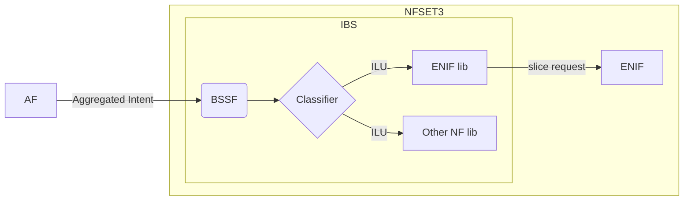

<!-- # © 2024 Telefónica Innovación Digital

# Licensed under the Apache License, Version 2.0 (the "License");
# you may not use this file except in compliance with the License.
# You may obtain a copy of the License at

#     http://www.apache.org/licenses/LICENSE-2.0

# Unless required by applicable law or agreed to in writing, software
# distributed under the License is distributed on an "AS IS" BASIS,
# WITHOUT WARRANTIES OR CONDITIONS OF ANY KIND, either express or implied.
# See the License for the specific language governing permissions and
# limitations under the License. -->
# The Intent Engine
*An Intent Based Network Translator in a Micro-Kernel Architecture*
# Introduction

The **Intent Engine** is a translator between different technologies, abstracting the specific details of network components from the general directives of higher-level components. This abstract order is known as Intent (*an intention*). It express an expectation of *what* the underlying technologies should do without knowing the *how*. 

Following the structure in [Specification # 28.312 (3gpp.org)](https://portal.3gpp.org/desktopmodules/Specifications/SpecificationDetails.aspx?specificationId=3554) an Intent is divided in :
- Expectation: which defines the requirements, goals and constraints of the Intent.
	- Object : containing the action to perform and object constrains.
	- Context : the scope of the action defined.
	- Target : the goals and constraints that should support the underlying technology.
- Context : the scope of the expectation.

This definition is broad, and is each library in the intent catalog is the one responsible for translating the intent into a network configuration. 

### A Micro-Kernel Architecture

As the networks are evolving continuously, the technologies should follow along. **The Intent Engine** is build as a central core that processes the Intent and then, tries to translate it to network configurations using the intent catalogue. The intent catalogue is a set of python libraries, each one containing a set of Intent Logic Units (ILUs). 

![Arquitecture]

Also, there is another type of catalogue, the executioners catalogue. It defines the inbound and outbound interfaces of the core. The executioners are managed by the execution platform as they can run independent communication processes with different technologies.

## 6Green: BSSF (NFSET3)

The **Business Support System Function** is a newly introduced component designed to manage the business aspects of network and slice reconfiguration. Its primary role is to enforce the dynamic green business model that governs the interactions between Telecom Operators and Vertical Stakeholders. As a result, this component serves as the entry point for handling vertical demands and processing slice requests. Its aims to enable the efficient deployment and management of 6G vertical slice expectations by aggregating and translating infrastructure slice intents, vertical SLAs, green intent expectations and user specific policies into a compound ENIF slice ready to by optimice. 


### Interactions in 6Green

Some updates have been done in how the BSSF interacts with the AF and the ENIF. 

![NFSET3]   

### AF to BSSF interface

This interface implements 3GPP TS 28.312. The intent represents a set of expectations, targets and constrains that the network should perform. The three main fields will try to describe the next concepts:
- Verb: is the action is expected to perform. Usual verbs here could be "request", "deploy", "assure"...
- Contexts: the scope of the expectation, verb or target associated to it.
- Targets: the different objectives of the expectations. 

There are different types of expectations that the BSSF can translate.
#### Slice deployment (alpha version)

A preliminary slice deploy expectation that simplifies all the details in the Induce *SliceIntent* API in a 3GPP version of it. The main targets or objectives to be optimize could be similar to the following one:
```yaml
Targets:
 - AttributeName: 'access_47'
   Attribute: 'guaranteed_bandwidth'
   Condition: 'IS_WITHIN_RANGE'
   ValueRange: '[120.0,200.0] kbps'
   Contexts: {scope of the restriction}
```
#### Green specific targets *new (alpha version)

The new expectation targets will be based on BEREC sustainability indicators for  
electronic communications networks and services. Thanks to these new constrains the NFs in layers below should be able to optimize the deployment of a slice not only taking in account network restrictions such us maximum latency or minimum bandwidth, but also assure some level of decarbonization.

```yaml
Targets:
  - AttributeName: 'administrativeID'
    Attribute: 'SliceEnergyConsumption'
    Condition: See NOTE 1
    ValueRange: See NOTE 2
```

   **Note 1**. Usual allowed values for Condition field are: IS_EQUAL_TO, IS_LESS_THAN, IS_GREATER_THAN, IS_WITHIN_RANGE, IS_OUTSIDE_RANGE, IS_ONE_OF, IS_NOT_ONE_OF, IS_EQUAL_TO_OR_LESS_THAN, IS_EQUAL_TO_OR_GREATER_THAN, IS_ALL_OF.
   **Note 2.** Although the objective is to maximize sustainability, the values will be acceptable boundaries where the optimization algorithms can work. 


### Intent aggregation

## About this repository

This code is currently under development, with different parts being developed in separate projects. 
- 6GREEN : (repo: )
	- Libraries: green_bssf, enif_slice
	- Executioners: http_handler
- TID : (repo: )
	- Intent Core

# Intent life-cycle

The final idea of **The Intent Engine** is to be an enabler towards a total Autonomic Nework as defined in [Intent-Based Networking - Concepts and Definitions (ietf.org)](https://www.ietf.org/archive/id/draft-irtf-nmrg-ibn-concepts-definitions-05.html#name-lifecycle-2).  In this draft is also defined a complex life-cycle of a system capable of learning and assuring the incoming Intents. For the moment this is not supported, but there are several functionalities implemented and aiming for that final purpose.

## Intent translator

The Intent-Based System is capable of reading the intents that the AF. Then, it translates this expectation into a network slice configuration that ENIF can optimize using context and targets. This creates a layer abstraction and the possibility to update one side without updating the hole workflow.



As described in this picture, there are several steps inside the IBS, first the RabbitMQ queue is read, then is classified in the specific technology. These steps creates an atomic intent ready to by translated to L2S-M or any other imported library in the core. 

In this way, the MO express just an intention of creating a NEMO deployment, and the IBS understands that is L2S-M in this case. Also, having this intermediate steps, somehow provides an assurance that the CRD is created correctly as it can only correspond to a classified ILU.

Below, its shown an example of incoming intent and outgoing CRD. The first case is more human readable and just express the intention to create a new network between to points given some specifications.

```yaml

```

```yaml

```

## Intent classification

The classification is done using an attribute of each library called decision_tree:

```python
self.__decision_tree=
```

Then, the classifier in the intent core collects all the decision trees of every library and do a simple comparison with the general intent. In this case, if detects that is a NEMO deployment it will refer to the L2S-M library and create the atomic intent that the library can understand and execute.

# Structure

The code follows this structure:

- Intent-engine
	- catalogue
		- **green_bssf.py**
		- **enif_slice.py**
	- executioners
		- **http_handler.py**
	- core
		- intent_core.py
		- ib_object.py
		- importer.py
		- translator.py
		- intent_classifier.py
	- intent_catalogue.in
	- executioner_catalogue.in

**In bold, the part of the new code developed to the 6Green project.**

# Functionalities

The functionalities available for this version are:
- Connect to RabbitMQ queue. Starts a RabbitMQ consumer and waits for intents to be posted.
- Translation of the MO intent to a CRD L2S-M can process.
- Send the intent expectation to L2S-M.
## Getting started

1. Download source code.
2. Start intent engine:
	- Run intent_core.py. 
```bash
cd intent_engine/
python3 code/intent_core.py
```

4. Generate a test RabbitMQ message
	- Install a RabbitMQ broker docker image
```bash
docker run -d --hostname my-rabbit --name some-rabbit -e RABBITMQ_DEFAULT_VHOST=my_vhost rabbitmq:3-management
```
5. Create a queue called mo.mncc in the broker (localhost:15672).
6. Send a test Intent to the intent engine
```bash
cd intent_engine/
python3 code/executioners/rabbitMQ_emit.py
```

# Support

For any feedback or doubts about **The Intent Engine** don't hesitate to contact us:
- Guillermo S. Illán : guillermo.sanchezillan@telefonica.com
- Luis Miguel Contreras Murillo : luismiguel.contrerasmurillo@telefonica.com
# Acknowledgments

The work in this open-source project has partially been granted by :
- [NEMO]([HOME - META-OS](https://meta-os.eu/)) (EU Horizon Europe Grant Agreement No. 101070118).
- [6Green]([6Green - Web](https://www.6green.eu/)) (101096925 – 6Green – HORIZON-JU-SNS-2022) 