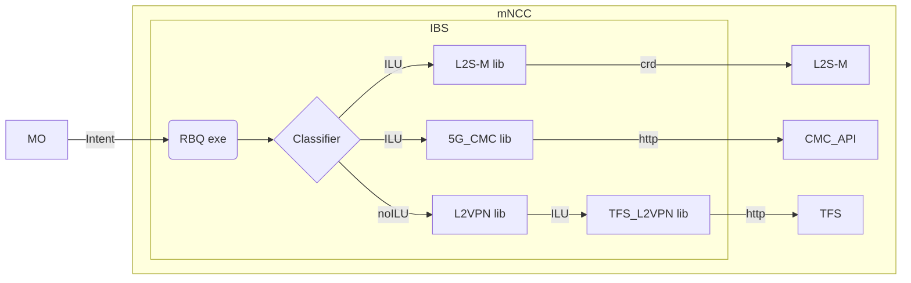

# The Intent Engine
*An Intent Based Network Translator in a Micro-Kernel Architecture*

Original repository: https://github.com/Telefonica/intent_engine/tree/nemo
# Introduction

The **Intent Engine** is a translator between different technologies, abstracting the specific details of network components from the general directives of higher-level components. This abstract order is known as Intent (*an intention*). It express an expectation of *what* the underlying technologies should do without knowing the *how*. 

Following the structure in [Specification # 28.312 (3gpp.org)](https://portal.3gpp.org/desktopmodules/Specifications/SpecificationDetails.aspx?specificationId=3554) an Intent is divided in :
- Intent:
  - intentContext: Is the scope of the intent itself. It could be used to define administrative task as priority of the intent, times of applicability or identification. This is jet to be define before the final version.
  - intentExpectations: is the request that the user makes to the network
    - expectationVerb: is the main action of the intention. This is usually a verb like create, request, modify, delete, deliver…
    - expectationObject: is the direct complement of the action. The object has a type and an instance, conceptually very similar to a programming language class and its instantiation. Also, the object contains its own objectContext list to provide the required information of itself.
    - expectationContexts: are the scopes in which the expectation is applied. Here are defined where (or when) the action must be performed. For example, a certain RAN area or a specific active cluster.
    - expectationTargets: are the goals or objectives to be reached with the expectation. Translated to a transport network this could be restrictions in bandwidths, latencies, jitter… Every target can also have a more specific context in which is applied.

This definition is broad, and is each library in the intent catalog is the one responsible for translating the intent into a network configuration. 

### A Micro-Kernel Architecture

As the networks are evolving continuously, the technologies should follow along. **The Intent Engine** is build as a central core that processes the Intent and then, tries to translate it to network configurations using the intent catalogue. The intent catalogue is a set of python libraries, each one containing a set of Intent Logic Units (ILUs). 


Also, there is another type of catalogue, the executioners catalogue. It defines the inbound and outbound interfaces of the core. The executioners are managed by the execution platform as they can run independent communication processes with different technologies.
## Interactions in NEMO

ΝΕΜΟ establishes itself as the gamechanger of the AIoT-edge-cloud continuum by introducing an open source, modular and cybersecure meta-operating system, leveraging on existing technologies and introducing novel concepts, methods, tools, testing and engagement campaigns. NEMO will bring intelligence closer to the data and make AI-as-a-Service an integral part of network self-organisation and micro-services execution orchestration. Its widespread penetration and massive acceptance will be achieved via new technology, pre-commercial exploitation components and liaison with open-source communities.

In the NEMO meta-Operating System, the WP2 related technologies are essential to enhance  “by design” cybersecure microservices Digital Twins (CMDT), advanced Cybersecure Federated Deep Reinforcement Learning (CF-DRL) and realize reliable on-demand self-healing end-to-end cloud clusters, including dynamic management of 5G micro-slices/resources (mNCC). The Intent Based System is included as part of this last one, the meta Network Cluster Controller.


### Cybersecure by Design

The NEMO project is concern about the cyber-security from the designing phases to the end of the development.

In the case of this module some of well known techniques are followed:
- Input validation : all the intents coming from the MO are checked to be in a *json* structure and to have closed intent structure.
- Well known APIs : the software uses as principal way of communication the RabbitMQ broker. As a well know message broker it has regular updates and intrinsic cyber-secure  techniques.   
- Data disclosure : no data is exposed to the network in an open way or without a previous order of an internal component.
## About this repository

This code is currently under development, with different parts being developed in separate projects. 
- NEMO : (repo: )
	- Libraries: l2sm, nemo
	- Executioners: CRDs, rabbitMQ
- TID : (repo: https://github.com/Telefonica/intent_engine/tree/nemo)
	- Intent Core

# Intent life-cycle

The final idea of **The Intent Engine** is to be an enabler towards a total Autonomic Nework as defined in [Intent-Based Networking - Concepts and Definitions (ietf.org)](https://www.ietf.org/archive/id/draft-irtf-nmrg-ibn-concepts-definitions-05.html#name-lifecycle-2).  In this draft is also defined a complex life-cycle of a system capable of learning and assuring the incoming Intents. For the moment this is not supported, but there are several functionalities implemented and aiming for that final purpose.
## Intent translator

The Intent-Based System is capable of reading the intents that the Meta-Orchestrator writes in the RabbitMQ queue. Then, it translates this expectation into a network configuration that L2S-M understands. This creates a layer abstraction and the possibility to update one side without updating the hole workflow.



As described in this picture, there are several steps inside the IBS, first the RabbitMQ queue is read, then is classified in the specific technology. These steps creates an atomic intent ready to by translated to L2S-M or any other imported library in the core. 

In this way, the MO express just an intention of creating a NEMO deployment, and the IBS understands that is L2S-M in this case. Also, having this intermediate steps, somehow provides an assurance that the CRD is created correctly as it can only correspond to a classified ILU.

Below, its shown an example of incoming intent and outgoing CRD. The first case is more human readable and just express the intention to create a new network between to points given some specifications.

```yaml
Intent:
  id: 'mncc_l2sm_1'
  userLabel: 'cloud_continuum'
  intentExpectations:
    - expectationId: '1'
      expectationVerb: 'DELIVER'
      expectationObject: 
        objectType: 'L2SM_Network'
        objectInstance: 'spain_network'
        objectContexts:
          - contextAttribute: 'network'
            contextCondition: 'IS_EQUAL_TO'
            contextValueRange: 'spain_network'
          - contextAttribute: 'provider_name'
            contextCondition: 'IS_EQUAL_TO'
            contextValueRange: 'uc3m'
          - contextAttribute: 'domain'
            contextCondition: 'IS_EQUAL_TO'
            contextValueRange: 'idco.uc3m.es'
      expectationTargets:
        - targetName: 'secure'
          targetCondition: 'IS_EQUAL_TO'
          targetValueRange: 'accessList'
          targetContexts:
            - contextAttribute: 'public_key'
              contextCondition: 'IS_EQUAL_TO'
              contextValueRange: 'sxySO0jHw4h1kcqO/LMLDgOo...'
  intentContexts:
   - contextAttribute: 'l2sm_url'
     contextCondition: 'IS_EQUAL_TO'
     contextValueRange: 'http://192.168.165.168:8080'
  intentPriority: 1
  observationPeriod: 60
  intentAdminState: 'ACTIVATED'

```

```yaml
apiVersion: l2sm.k8s.local/v1
kind: L2SMNetwork
metadata:
  name: spain-network
spec:
  type: inter-vnet
  config: |
    {
      "provider": {
        "name": "uc3m",
        "domain": "idco.uc3m.es"
      },
      "accessList": ["public-key-1", "public-key-2"]
    }
  signature: sxySO0jHw4h1kcqO/LMLDgOoOeH8dOn8vZWv4KMBq0upxz3lcbl+o/36JefpEwSlBJ6ukuKiQ79L4rsmmZgglk6y/VL54DFyLfPw9RJn3mzl99YE4qCaHyEBANSw+d5hPaJ/I8q+AMtjrYpglMTRPf0iMZQMNtMd0CdeX2V8aZOPCQP75PsZkWukPdoAK/++y1vbFQ6nQKagvpUZfr7Ecb4/QY+hIAzepm6N6lNiFNTgj6lGTrFK0qCVfRhMD+vXbBP6xzZjB2N1nIheK9vx7kvj3HORjZ+odVMa+AOU5ShSKpzXTvknrtcRTcWWmXPNUZLoq5k3U+z1g1OTFcjMdQ====
```

In general, this provides the mNCC with the flexibility to incorporate additional technology adapters without relying on the MO's knowledge about them.

## Intent models/schemas for assurance

The internal data model follows the OpenApi schemas from the 18.2.1 version of 3GPP TS 28.312. All this files are available in (https://github.com/jdegre/5GC_APIs/tree/Rel-18). A new mNCC intent schema has been created as an inheritance of TS28312_IntentNrm.yaml#/schemas/componets/Intent-Single. In this way the mNCC intent will have to fulfill both schemas to be processed, the general specification and the mNCC specific.

The internal data model is using [Pydantic](https://docs.pydantic.dev/latest/) library. To compile the OpenApi specification directly to the code in a Pydantic modeling, the library used is [datamodel code generator](https://pypi.org/project/datamodel-code-generator/). 

Validating the input intent against this schemas provides a first approach on intent assurance. For example, ****

Compiling steps:

```bash
insert code*************
```

## Intent classification

The classification is done using an attribute of each library called decision_tree:

```python
self.__decision_tree={
					"cloud_continuum": {
						"nemo_deployment":{
							"create":{
								"vpnl2":"vpn",
								"overlay":"l2sm"
								},
							"modify":"l2sm",
							"migrate":"sdnc l2sm"
							}
						}
					}
```

Then, the classifier in the intent core collects all the decision trees of every library and do a simple comparison with the general intent. In this case, if detects that is a NEMO deployment it will refer to the L2S-M library and create the atomic intent that the library can understand and execute.
# Structure

The code follows this structure:

- Intent-engine
	- catalogue
		- **mNCC_intent.py**
		- **l2sm.py**
	- executioners
		- **rabbitmq.py**
		- **crd.py**
	- core
		- intent_core.py
		- ib_object.py
		- importer.py
		- translator.py
		- intent_classifier.py
	- intent_catalogue.in
	- executioner_catalogue.in

**In bold, the part of the code belonging to the NEMO project.**
# Functionalities

The functionalities available for this version are:
- Connect to RabbitMQ queue. Starts a RabbitMQ consumer and waits for intents to be posted.
- Translation of the MO intent to a CRD L2S-M can process.
- Send the intent expectation to L2S-M.
## Getting started

1. Download source code.
2. Start intent engine:
	- Run intent_core.py. 
```bash
cd intent_engine/
python3 code/intent_core.py
```

4. Generate a test RabbitMQ message
	- Install a RabbitMQ broker docker image
```bash
docker run -d --hostname my-rabbit --name some-rabbit -e RABBITMQ_DEFAULT_VHOST=my_vhost rabbitmq:3-management
```
5. Create a queue called mo.mncc in the broker (localhost:15672).
6. Send a test Intent to the intent engine
```bash
cd intent_engine/
python3 code/executioners/rabbitMQ_emit.py
```
## CI/CD in NEMO

# Support

For any feedback or doubts about **The Intent Engine** don't hesitate to contact us:
- Guillermo S. Illán : guillermo.sanchezillan@telefonica.com
- Luis Miguel Contreras Murillo : luismiguel.contrerasmurillo@telefonica.com
# Acknowledgments

The work in this open-source project has partially been granted by :
- [NEMO]([HOME - META-OS](https://meta-os.eu/)) (EU Horizon Europe Grant Agreement No. 101070118).
- [6Green](6Green - Web) (101096925 – 6Green – HORIZON-JU-SNS-2022)