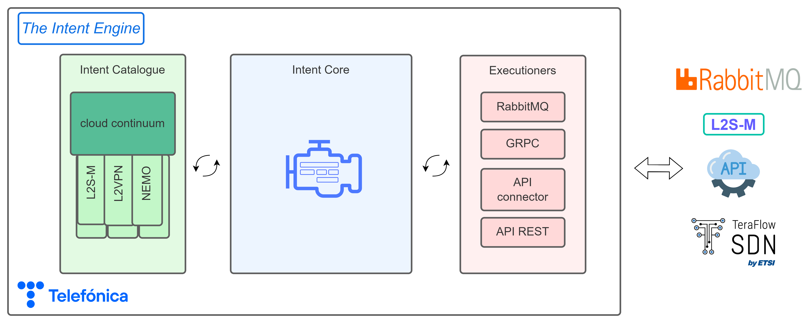
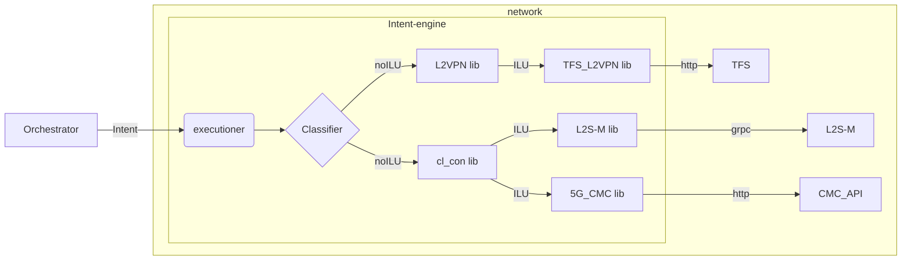

<!-- # © 2024 Telefónica Innovación Digital

# Licensed under the Apache License, Version 2.0 (the "License");
# you may not use this file except in compliance with the License.
# You may obtain a copy of the License at

#     http://www.apache.org/licenses/LICENSE-2.0

# Unless required by applicable law or agreed to in writing, software
# distributed under the License is distributed on an "AS IS" BASIS,
# WITHOUT WARRANTIES OR CONDITIONS OF ANY KIND, either express or implied.
# See the License for the specific language governing permissions and
# limitations under the License. -->

# The Intent Engine
*An Intent Based Network Translator in a Micro-Kernel Architecture*

*(under development)*
# Introduction

The **Intent Engine** is a translator between different technologies, abstracting the specific details of network components from the general directives of higher-level components. This abstract order is known as Intent (*an intention*). It express an expectation of *what* the underlying technologies should do without knowing the *how*. 

Following the structure in [Specification # 28.312 (3gpp.org)](https://portal.3gpp.org/desktopmodules/Specifications/SpecificationDetails.aspx?specificationId=3554) an Intent is divided in :
- Intent:
  - intentContext: Is the scope of the intent itself. It could be used to define administrative task as priority of the intent, times of applicability or identification. This is jet to be define before the final version.
  - intentExpectations: is the request that the user makes to the network
    - expectationVerb: is the main action of the intention. This is usually a verb like create, request, modify, delete, deliver…
    - expectationObject: is the direct complement of the action. The object has a type and an instance, conceptually very similar to a programming language class and its instantiation. Also, the object contains its own objectContext list to provide the required information of itself.
    - expectationContexts: are the scopes in which the expectation is applied. Here are defined where (or when) the action must be performed. For example, a certain RAN area or a specific active cluster.
    - expectationTargets: are the goals or objectives to be reached with the expectation. Translated to a transport network this could be restrictions in bandwidths, latencies, jitter… Every target can also have a more specific context in which is applied.

This definition is broad, and is each library in the intent catalog is the one responsible for translating the intent into a network configuration. 

### A Micro-Kernel Architecture

As the networks are evolving continuously, the technologies should follow along. **The Intent Engine** is build as a central core that processes the Intent and then, tries to translate it to network configurations using the intent catalogue. The intent catalogue is a set of python libraries, each one containing a set of Intent Logic Units (ILUs). 

Also, there is another type of catalogue, the executioners catalogue. It defines the inbound and outbound interfaces of the core. The executioners are managed by the execution platform as they can run independent communication processes with different technologies.

# Intent life-cycle

The final idea of **The Intent Engine** is to be an enabler towards a total Autonomic Nework as defined in [Intent-Based Networking - Concepts and Definitions (ietf.org)](https://www.ietf.org/archive/id/draft-irtf-nmrg-ibn-concepts-definitions-05.html#name-lifecycle-2).  In this draft is also defined a complex life-cycle of a system capable of learning and assuring the incoming Intents. For the moment this is not supported, but there are several functionalities implemented and aiming for that final purpose.

## Intent translator

The Intent Engine is capable of reading incoming intents to the engine via any of the executioners. Then, it translates this expectation into a network configuration that the underlaying network can understand. This creates a layer abstraction and the possibility to update one side without updating the hole workflow.

# About this repo

Each branch is the development in the different projects.

# Support

For any feedback or doubts about **The Intent Engine** don't hesitate to contact us:
- Guillermo S. Illán : guillermo.sanchezillan@telefonica.com
- Luis Miguel Contreras Murillo : luismiguel.contrerasmurillo@telefonica.com

# Acknowledgments

The work in this open-source project has partially been granted by :
- [NEMO]([HOME - META-OS](https://meta-os.eu/)) (EU Horizon Europe Grant Agreement No. 101070118).
- [6Green]([6Green - Web](https://www.6green.eu/)) (101096925 – 6Green – HORIZON-JU-SNS-2022) 

# License

© 2024 Telefónica Innovación Digital

Licensed under the Apache License, Version 2.0 (the "License");
you may not use this file except in compliance with the License.
You may obtain a copy of the License at

    http://www.apache.org/licenses/LICENSE-2.0

Unless required by applicable law or agreed to in writing, software
distributed under the License is distributed on an "AS IS" BASIS,
WITHOUT WARRANTIES OR CONDITIONS OF ANY KIND, either express or implied.
See the License for the specific language governing permissions and
limitations under the License.
